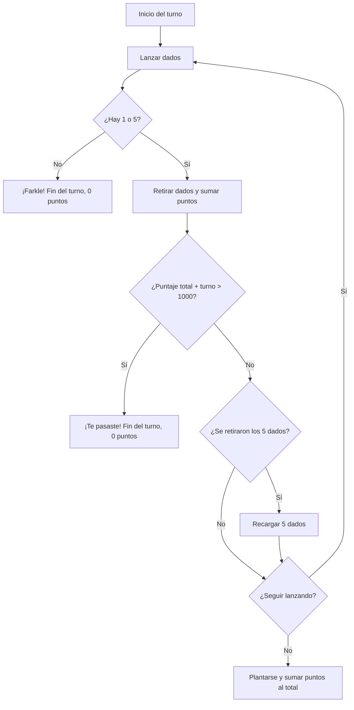

<div align="center">
  <h1>Farkle TP - Programación 1 (2026)</h1>
  
  
  
  <br>
  <br>
  <p>
    <b>Universidad Nacional de Rosario (UNR)</b><br>
    <i>Facultad de Ciencias Económicas y Estadística</i><br>
    Licenciatura en Estadística &nbsp;&bull;&nbsp; Licenciatura en Ciencia de Datos
  </p>
</div>

Trabajo Práctico de la materia **Programación 1** - Implementación del clásico juego de dados **Farkle** en el lenguaje **R**.

### Grupo Nº 12
- **Vazquez, Santos Nicolás** ([@nicovzq](https://github.com/nicovzq)) - Comisión 4A
- **Morello, Nino Julián** ([@ninomorello2008-coder](https://github.com/ninomorello2008-coder)) - Comisión 2A
- **Mengarelli, Luca Franco** ([@lfmen](https://github.com/lfmen)) - Comisión 1B

---

## Reglas del juego

- Se juega entre **dos jugadores**, alternando turnos.
- En cada turno se lanzan **5 dados**.
- Cada **1** suma **100 puntos**; cada **5** suma **50 puntos**.
- Los dados que muestran 1 o 5 se retiran; con los restantes el jugador puede optar por seguir tirando o plantarse.
- Si ningún dado muestra 1 o 5 (situación de Farkle), el turno finaliza inmediatamente y **se pierden los puntos acumulados** en ese turno.
- Si todos los dados son retirados, se habilita una nueva tirada con 5 dados manteniendo el puntaje acumulado del turno en curso.
- **Condición de victoria:** Resulta ganador el primero en alcanzar *exactamente* **1000 puntos**. Si la sumatoria supera ese valor, los puntos del turno en curso se descartan.

### Flujo de un turno



---

## Instalación y ejecución

Para ejecutar el proyecto, se debe asegurar que el entorno cuente con **R** instalado. 

### Dependencias requeridas
El juego requiere instalar el paquete `farkle` provisto por la cátedra. Ejecutar este bloque de código **una sola vez** en la consola de R previo a iniciar el programa:

```r
install.packages("pak")
pak::pkg_install("ee-unr/programacion-1/tp/farkle")
```

### Iniciar el juego
Desde la terminal, situarse en el directorio raíz del proyecto y ejecutar el siguiente comando:

```bash
Rscript jugar.R
```

Al iniciar el juego, verás la siguiente presentación en tu terminal:

```text
  ____  __    ___ _  __ _    ___ 
 | ___|/  \  | _ \ |/ /| |  | __|
 | _/ / _  \ |   /   < | |__| _| 
 |_| /_/ \__\|_|_\_|\_\|____|___|

 ================================
       EL JUEGO DE DADOS
 ================================
```

---

## Estructura y diseño

### Archivos del proyecto
```text
├── jugar.R        # Script principal (punto de entrada)
├── funciones.R    # Lógica del juego: calcular_puntaje_tirada, dados_sin_puntaje, ejecutar_turno
├── interfaz.R     # Interfaz de usuario: pantalla_inicio, mostrar_puntaje, mostrar_turno
├── .gitignore     # Archivos y directorios excluidos del control de versiones
├── LICENSE        # Especificación de la Licencia MIT
└── README.md      # Documentación general del proyecto
```

### Decisiones de diseño
- **Modularización:** El código se encuentra lógicamente separado en `interfaz.R` (dedicado puramente al aspecto visual) y `funciones.R` (para la lógica de cálculo). De esta forma, el script principal (`jugar.R`) se mantiene conciso y enfocado en el bucle principal.
- **Estética e Interfaz:** El título principal fue diseñado mediante *ASCII art* para mantener un estilo sobrio de terminal, logrando una presentación adecuada al ejecutar el programa.

---

## División del trabajo

Usamos **GitHub** como repositorio compartido para el control de versiones. La redacción de la lógica y documentación fue asignada de la siguiente manera:

### `funciones.R`
| Función | Responsable |
|---|---|
| `calcular_puntaje_tirada` | Nino Morello |
| `dados_sin_puntaje` | Luca Mengarelli |
| `ejecutar_turno` | Nino Morello |

### `interfaz.R`
| Función | Responsable |
|---|---|
| `pantalla_inicio` | Nicolás Vazquez |
| `mostrar_puntaje` | Nicolás Vazquez |
| `mostrar_turno` | Nicolás Vazquez |

### `jugar.R` y Documentación
| Sección | Responsable |
|---|---|
| Programa principal (bucle de rondas, lógica de fin de juego) | Luca Mengarelli |
| Redacción y documentación (`README.md`) | Luca Mengarelli |

---

## Licencia

Este proyecto se distribuye bajo los términos de la [Licencia MIT](LICENSE).
